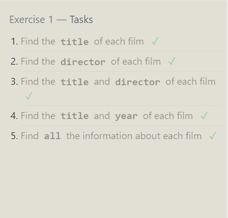
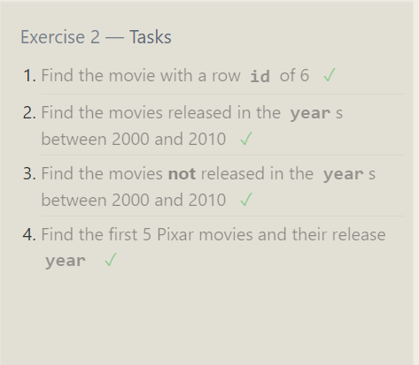
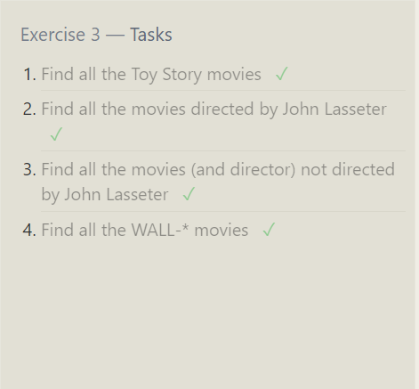
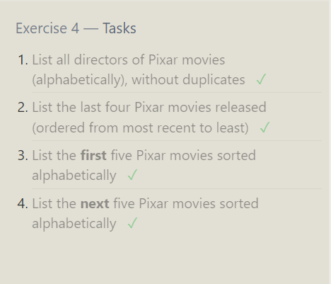
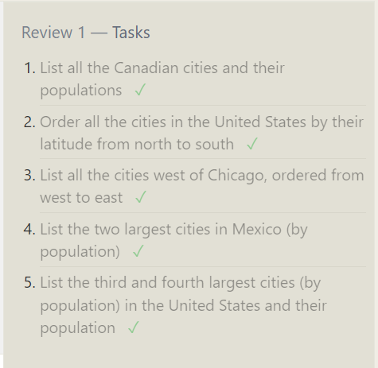
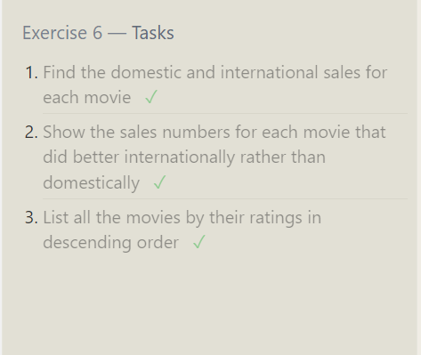

# intro to SQL

SQL stands for Structured Query Language, it is a language that is used to query, manipulate, and transforms data from a database. It can be used by technical and non-technical users.

## SELECT 
SELECT is a statement we write to retrieve data from a SQL database

Table: Movies
Example: SELECT title FROM movies

## Queries with constrains

We have the ability to filter the data we have in the database by using a WHERE clause in the query.

Examples: 
SELECT * FROM movies WHERE id = 6;
SELECT * FROM movies WHERE year BETWEEN 2000 AND 2010;
SELECT * FROM movies WHERE title LIKE "WALL-%" ;

## Filtering and sorting query results

### DISTINCT
It is used to remove a duplicate column value in rows. 

### ORDER BY 
It is used to sort results by a given column either in ascending or descending order

### LIMIT 
It reduces the number of rows that will be returned 

## OFFSET
It specifies where to begin counting the number rows from

Examples:
SELECT * FROM movies ORDER BY year DESC  LIMIT 4 ;
SELECT * FROM movies ORDER BY title ASC  LIMIT 5 offset 5 ;

## Data normalization 
The main purpose of it is to minimize the data by removing duplicate data in any single table.

### JOINS
By using JOIN we can combine row data separate tables using a unique key.

Examples:
SELECT * FROM Boxoffice inner join movies on movies.id = Boxoffice.Movie_id;

##  some examples on operations on tables
- delete FROM movies where year < 2005;
- UPDATE movies SET director = "John Lasseter" WHERE id = 2;
- INSERT INTO movies VALUES (4, "Toy Story 4", "El Directore", 2015, 90);

- CREATE TABLE Database (
    Name TEXT,
    Version FLOAT,
    Download_count INTEGER
);

- DROP TABLE BoxOffice;

.png)
.png)
.png)
.png)
.png)
.png)

